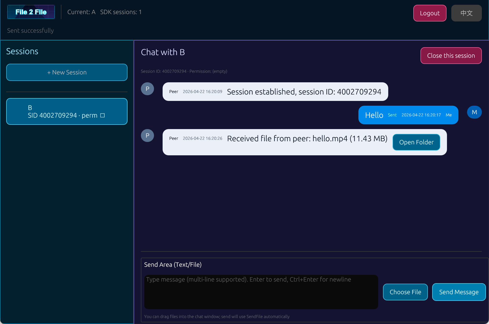

# File2File Desktop

[](https://www.rust-lang.org/)
[](https://webrpc.cn)
[](#中文--chinese)

[中文](#中文--chinese) | [English](#english)

---

## 中文 / Chinese

### 项目介绍

File2File 是一款专门用于文件点对点传输（P2P）的桌面软件，底层采用专业的 WebRPC P2P 通信组件。  
项目定位为**完全免费、开源**，目标是提供简单可靠、可持续扩展的文件传输体验。  
当前版本重点支持 **Windows、Linux ARM、Linux x86、macOS** 多平台部署，连接成功率可达 **99.9%**。

### 软件截图



### 核心能力

- 基于 Rust + `eframe/egui` 构建桌面客户端。
- 基于 WebRPC 进行点对点会话连接。
- 支持文本消息与文件传输。
- 支持会话管理与本地状态持久化。
- 支持接收文件本地存储与快速打开。

### 连接机制（Token + 口令）

- 登录连接依赖 WebRPC `token` 与可选口令。
- 当口令为空时：任何知道你 `token` 的用户都可以连接到你的会话。
- 当设置口令时：对方必须同时提供正确的 `token` 和口令才能建立连接。
- 若你尚未拥有 WebRPC `token`，请前往 [https://webrpc.cn](https://webrpc.cn) 申请。

### 快速开始

#### 环境要求

- Rust（建议使用稳定版）
- Cargo

#### 运行

```bash
cargo run
```

#### 快速编译（多平台可执行程序）

当需要快速编译所有平台可执行程序时，请执行：

```bash
./build.sh
```

构建完成后，产物通常输出到 `dist/` 目录（以脚本实际配置为准）。

常见失败排查：

- 提示 `Permission denied`：先执行 `chmod +x build.sh` 再重新运行。
- 提示依赖缺失：请先安装 Rust/Cargo 及脚本依赖工具链。
- 构建中断时：优先查看终端日志，定位具体平台或步骤失败原因。

### 使用说明

1. 启动客户端，输入你的 WebRPC `token`。
2. 根据安全需求选择是否设置连接口令（推荐设置）。
3. 将你的 `token`（及口令，如已启用）分享给对方。
4. 对方输入正确凭据后建立会话。
5. 在会话中发送文本消息或文件，接收文件将保存到本地目录。

### 本地数据目录

- 首次启动会在本地创建应用状态目录（用于保存会话与状态信息）。
- 接收文件保存在本地接收目录，便于后续查看和管理。

### 常见问题（FAQ）

**1) 为什么建议设置口令？**  
未设置口令时，只要对方知道你的 `token` 即可发起连接；启用口令可显著提升会话安全性。

**2) 口令忘记了怎么办？**  
直接在本端重新设置新口令，并将新凭据同步给可信对端。

**3) Token 从哪里获取？**  
从 WebRPC 官方站点申请：[https://webrpc.cn](https://webrpc.cn)。

### Roadmap

- [ ] 对接完整的在线鉴权与会话服务。
- [ ] 增强传输状态展示（进度、成功/失败重试）。
- [ ] 支持大文件断点续传。
- [ ] 完善多平台打包与自动发布流程。
- [ ] 补充更完整的自动化测试。

### 参与贡献

欢迎 Issue 与 PR。建议流程：

1. Fork 本仓库并创建功能分支。
2. 完成开发与自测。
3. 提交清晰的 Commit 信息。
4. 发起 Pull Request，描述改动动机与验证方式。

### 许可证

本项目采用 **Apache License 2.0** 开源协议。  
完整许可证内容请见仓库根目录 `LICENSE` 文件。

---

## English

### Overview

File2File is a desktop application dedicated to peer-to-peer (P2P) file transfer, powered by a professional WebRPC P2P communication component.  
The project is **free and open source**, aiming to provide a reliable and extensible transfer experience.  
The current release emphasizes cross-platform support for **Windows, Linux ARM, Linux x86, and macOS**, with a connection success rate of up to **99.9%**.

### Screenshot


### Key Features

- Desktop client built with Rust + `eframe/egui`.
- P2P session connectivity based on WebRPC.
- Text messaging and file transfer.
- Session management with local persistence.
- Local storage and quick access for received files.

### Connection Model (Token + Passphrase)

- Login/session connection is based on WebRPC `token` with an optional passphrase.
- If passphrase is empty: anyone who knows your `token` can connect.
- If passphrase is enabled: peers must provide both valid `token` and passphrase.
- If you do not have a WebRPC `token` yet, apply at [https://webrpc.cn](https://webrpc.cn).

### Quick Start

#### Requirements

- Rust (stable channel recommended)
- Cargo

#### Run

```bash
cargo run
```

#### Fast Build (All Platform Executables)

To quickly build executables for all supported platforms, run:

```bash
./build.sh
```

Build artifacts are typically generated in the `dist/` directory (subject to script configuration).

Common troubleshooting tips:

- `Permission denied`: run `chmod +x build.sh` and retry.
- Missing dependencies: ensure Rust/Cargo and required toolchains are installed.
- Interrupted build: inspect terminal logs to identify the failing platform or step.

### Usage

1. Launch the app and enter your WebRPC `token`.
2. Decide whether to set a session passphrase (recommended).
3. Share your `token` (and passphrase if enabled) with your peer.
4. Establish a session after credential verification.
5. Start sending messages/files; received files are saved locally.

### Local Data

- A local app-state directory is created on first launch.
- Received files are stored in a local receiving directory for easy access.

### FAQ

**1) Why should I enable a passphrase?**  
Without a passphrase, anyone with your `token` can attempt a session connection. A passphrase improves access control.

**2) What if I forget the passphrase?**  
Reset it on your side and share the new credentials only with trusted peers.

**3) Where can I get a token?**  
Apply from the official WebRPC portal: [https://webrpc.cn](https://webrpc.cn).

### Roadmap

- [ ] Integrate full online auth and session services.
- [ ] Improve transfer status UX (progress, retry, failures).
- [ ] Add resumable transfer for large files.
- [ ] Improve multi-platform packaging and release automation.
- [ ] Expand automated test coverage.

### Contributing

Issues and PRs are welcome. Suggested workflow:

1. Fork the repository and create a feature branch.
2. Implement changes and run local verification.
3. Use clear commit messages.
4. Open a Pull Request with motivation and test notes.

### License

This project is licensed under the **Apache License 2.0**.  
See the `LICENSE` file in the repository root for the full license text.

