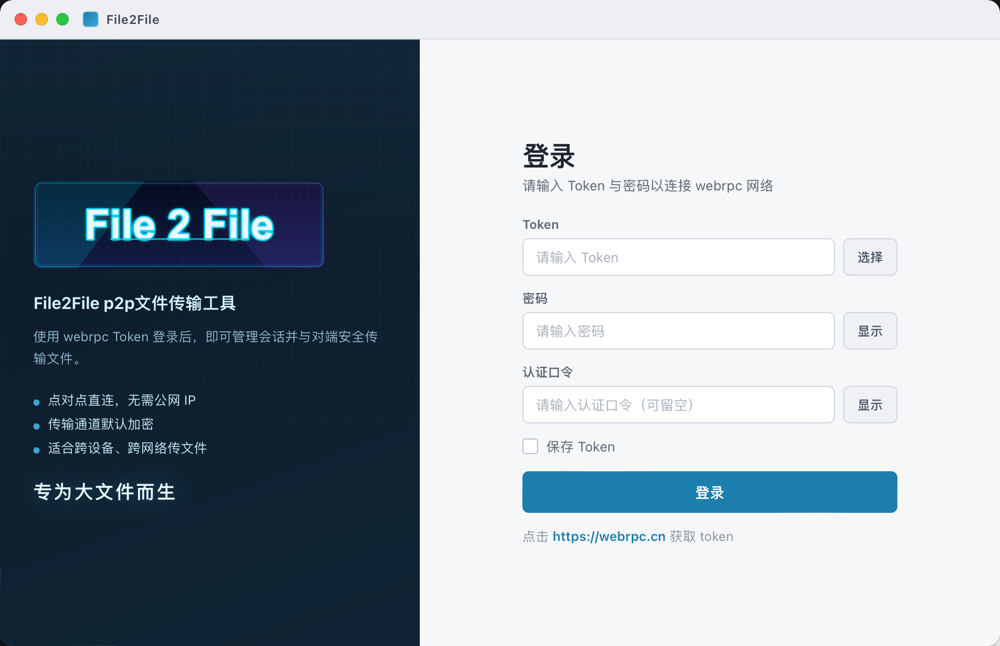
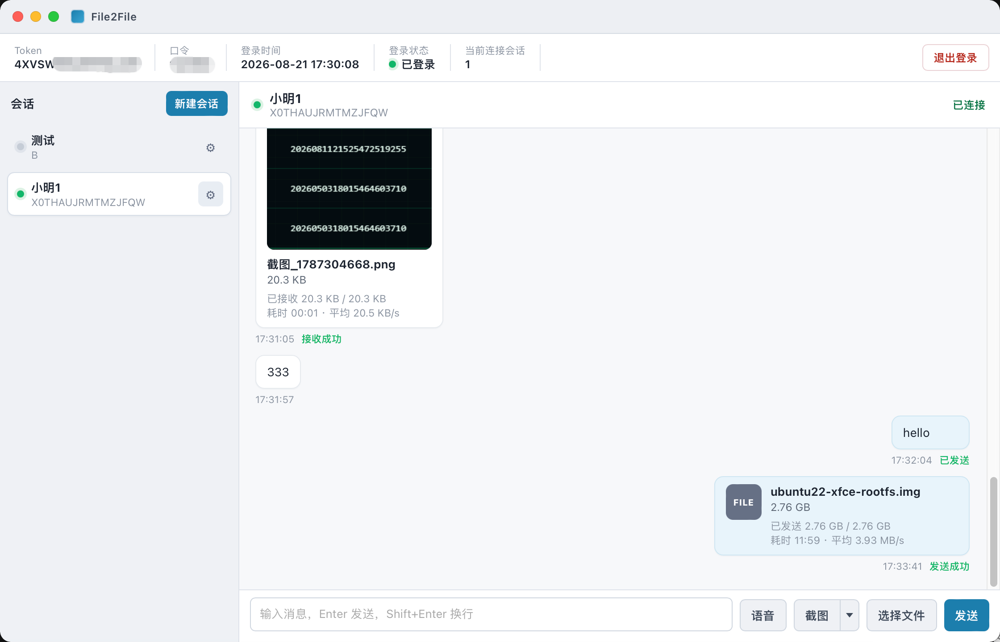
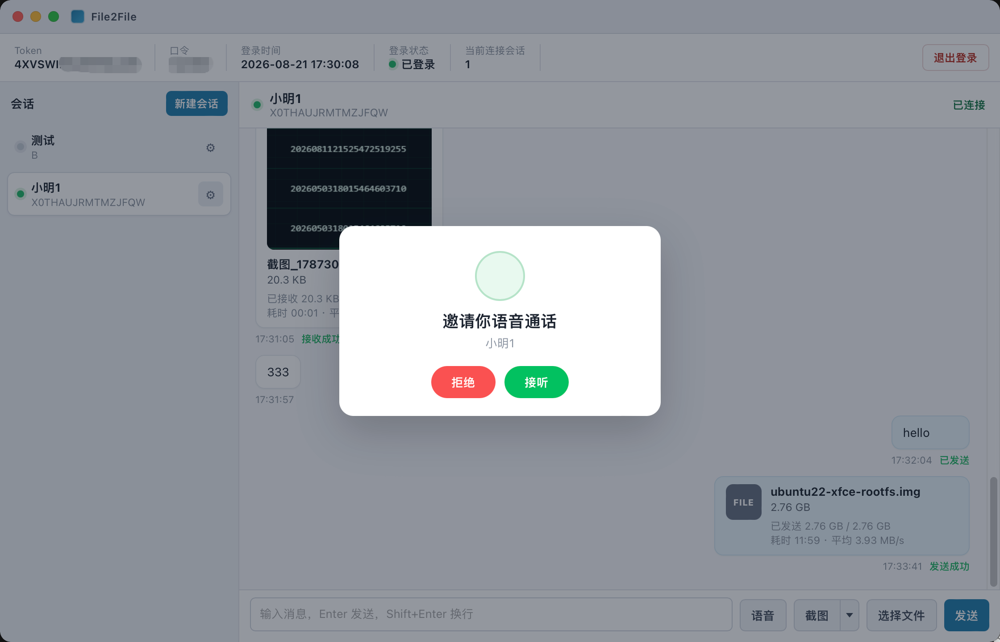
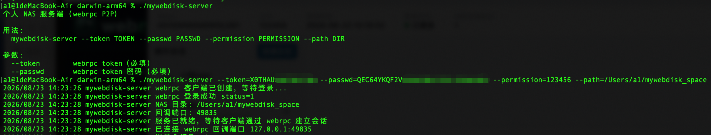
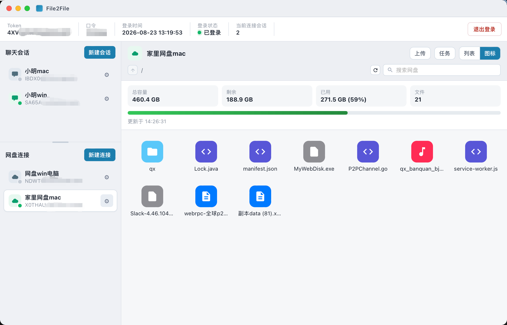
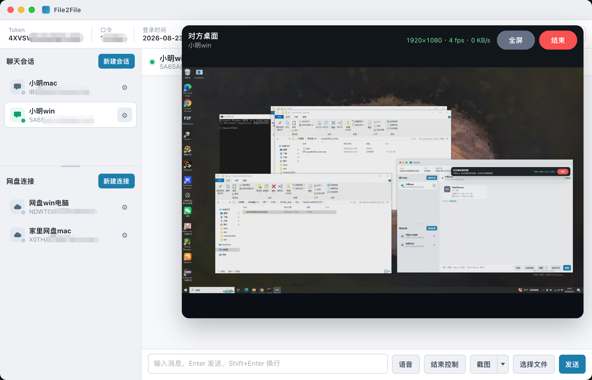

# File2File

**点对点文件传输、个人网盘与远程桌面桌面客户端**  
P2P 直连 · 默认加密 · 免费使用 · Windows / macOS / Linux

专为大文件、跨设备协作和个人 NAS 访问设计的桌面应用。登录页可**一键注册**并自动领取 webrpc Token，零门槛直连；也可使用已有 Token 登录，即可聊天、传文件、管理网盘或远程控制 Windows 电脑。

[简体中文](README.md) · [English](README.en.md)


**[下载已编译程序，解压或安装后即可使用 →](https://github.com/xiaoming-software/File2File-Desktop/tree/main/dist-tauri)**

---


## 目录

- [File2File 是什么](#file2file-是什么)
- [适合谁用](#适合谁用)
- [界面预览](#界面预览)
- [核心功能](#核心功能)
  - [聊天与大文件传输](#聊天与大文件传输)
  - [个人网盘 / NAS](#个人网盘--nas)
  - [远程桌面](#远程桌面)
  - [语音与截图](#语音与截图)
- [直接下载使用](#直接下载使用)
- [如何使用](#如何使用)
  - [方式 A：一键注册（推荐，零门槛）](#方式-a一键注册推荐零门槛)
  - [方式 B：使用已有 Token 登录](#方式-b使用已有-token-登录)
- [当前限制](#当前限制)
- [从源码构建](#从源码构建)
- [常见问题](#常见问题)
- [技术栈](#技术栈)
- [后续规划](#后续规划)

---


## File2File 是什么

**File2File** 是一款基于 [webrpc](https://webrpc.cn) 的跨平台桌面客户端，把三件事放在同一个窗口里：

1. **点对点传输**：两端直连后发消息、传任意大小的文件，不必先上传到公有云。
2. **个人网盘管理**：连接自己运行的 `mywebdisk-server`，像资源管理器一样浏览、上传、下载、搜索家里的磁盘。
3. **远程控制桌面**：在已连接的电脑会话里查看并鼠标操作对方屏幕（目前支持控制 Windows；macOS 暂不支持被控）。

通道默认加密，**不需要公网 IP**，也不把文件托管到中心化网盘。Token 就是你的身份，认证口令可以挡住不认识的人。

它不是又一个网盘 App 套壳，也不是必须付费的远控软件。客户端免费，预编译包可直接运行。

---


## 适合谁用

- 经常在 Windows、Mac、Linux 之间搬 **GB 级安装包、镜像、素材** 的人
- 希望在外面安全访问 **家里电脑或 NAS 目录**，自己掌握数据存放位置
- 需要临时 **远程看一眼、点几下** 对方 Windows 桌面，又不想单独再装一套远控
- 团队或家人之间要同时聊天、传文件、偶尔语音的场景

---


## 界面预览



*登录：支持一键注册领取 Token，或填入已有 Token 直接登录*



*会话：文字、截图与大文件走同一条加密通道（示例：2.76 GB，平均 3.93 MB/s）*



*语音：来电弹窗，一键接听或拒绝*



*个人网盘服务端：在存放文件的那台机器上启动 mywebdisk-server*



*网盘资源管理器：连接自己的网盘后，可浏览容量、上传下载、搜索文件*



*远程桌面：控制对方 Windows 电脑，支持全屏和鼠标操作*

---


## 核心功能


### 聊天与大文件传输

- 会话备注、本地历史，下次登录还能用
- Enter 发消息，Shift+Enter 换行
- 选择文件或拖进窗口即可发送；进度、耗时、均速显示在卡片上
- 针对大文件设计，GB 级内容可以一次传完


### 个人网盘 / NAS

在家里电脑、闲置主机或任意目录上运行配套的 **[mywebdisk-server](https://github.com/xiaoming-software/mywebdisk)**，再用 File2File 左侧「网盘连接」连上，即可当个人云盘用。数据留在你指定的目录里，读写都走 webrpc 加密通道。

服务端源码与各平台预编译程序都在仓库里，下载即可运行，不必自己编译：

**[https://github.com/xiaoming-software/mywebdisk](https://github.com/xiaoming-software/mywebdisk)**

资源管理器支持：


| 能力  | 说明                      |
| --- | ----------------------- |
| 浏览  | 列表 / 图标视图，面包屑导航，容量与剩余空间 |
| 上传  | 按钮上传，或把本地文件拖进当前目录       |
| 下载  | 右键下载；任务面板可看进度、重试        |
| 整理  | 新建、重命名、移动、删除、压缩         |
| 搜索  | 顶部「搜索网盘」                |
| 多选  | 框选或批量拖拽移动               |


服务端启动示例（在存放文件的那台机器上）：

```bash
./mywebdisk-server \
  --token=<webrpc Token> \
  --passwd=<Token 密码> \
  --permission=<认证口令，可自定> \
  --path=<要共享的本地目录>
```

启动成功后终端会提示「服务已就绪」。然后在 File2File 里用 **同一个 Token** 添加网盘连接。

### 远程桌面

在已连接的 **电脑会话**（不是网盘会话）里点「远程控制」，对方同意后即可看到对方桌面。

- **全屏**：在应用窗口内放大画面
- **鼠标**：移动、单击、右键、双击、滚轮
- **码率与分辨率**：标题栏显示分辨率、帧率和 KB/s
- **方向**：是控制对方电脑，不是分享自己的屏幕

当前限制见下文「当前限制」。

### 语音与截图

- 语音：邀请、接听、拒绝、挂断、静音，带回声消除
- 截图：框选屏幕后直接发到当前会话；可先隐藏本窗口再截（macOS 快捷键 `⌃⌘A`）

---


## 为什么选 File2File


| 亮点             | 说明                                                                                                  |
| -------------- | --------------------------------------------------------------------------------------------------- |
| **零门槛上手**      | 登录页 **一键注册**：自动创建 webrpc 账户、领取免费 Token 并填入登录框，确认后即可使用，无需先去官网折腾。                                     |
| **P2P 直连**     | 打通后直传，无需公网 IP，也不必先把文件丢到第三方网盘。                                                                       |
| **默认加密**       | 传输通道加密；Token + 可选认证口令。                                                                              |
| **个人网盘自己管**    | 目录和机器都在你手里，File2File 只负责连上去读写。                                                                      |
| **远控集成在同一客户端** | 聊天、传文件、远控不用来回切换软件。                                                                                  |
| **完全免费**       | 客户端不向用户收取传输费用。                                                                                      |
| **多平台**        | macOS、Windows、Linux（x86_64 / ARM64）同一套操作。                                                           |
| **开箱即用**       | [仓库里已有各平台编译产物](https://github.com/xiaoming-software/File2File-Desktop/tree/main/dist-tauri)，下载即可运行。 |


---


## 直接下载使用

不需要本机安装 Rust 或 Tauri。打开预编译目录，按自己的系统取对应文件即可：

**[https://github.com/xiaoming-software/File2File-Desktop/tree/main/dist-tauri](https://github.com/xiaoming-software/File2File-Desktop/tree/main/dist-tauri)**


| 系统                | 目录与文件                                                                                                                             | 说明                            |
| ----------------- | --------------------------------------------------------------------------------------------------------------------------------- | ----------------------------- |
| Windows 10/11 x64 | `[dist-tauri/windows-x64/File2File.exe](https://github.com/xiaoming-software/File2File-Desktop/tree/main/dist-tauri/windows-x64)` | 需要 WebView2（Win10/11 通常已自带）   |
| macOS 11+         | `[dist-tauri/macos/File2File.app](https://github.com/xiaoming-software/File2File-Desktop/tree/main/dist-tauri/macos)`             | 首次打开若被拦截，请在「系统设置 → 隐私与安全性」中允许 |
| Linux amd64       | `[dist-tauri/linux-amd64/](https://github.com/xiaoming-software/File2File-Desktop/tree/main/dist-tauri/linux-amd64)` 下的 `.deb`    | Debian / Ubuntu 等             |
| Linux arm64       | `[dist-tauri/linux-arm64/](https://github.com/xiaoming-software/File2File-Desktop/tree/main/dist-tauri/linux-arm64)` 下的 `.deb`    | 如 ARM 主板、树莓派 64 位             |


个人网盘还需要在「有磁盘的那台机器」上另外运行 `mywebdisk-server`。File2File 是客户端，服务端从下面仓库下载预编译程序即可：

**[https://github.com/xiaoming-software/mywebdisk](https://github.com/xiaoming-software/mywebdisk)**

该仓库含 macOS / Linux / Windows 可执行文件，以及源码。用 File2File 连网盘时，一般只需要其中的 **mywebdisk-server**，不必再装它自带的桌面客户端。

---


## 如何使用

两端（或网盘服务端）都需要 [webrpc.cn](https://webrpc.cn) 的 **Token** 与 **密码**。File2File 提供两种登录方式，新手推荐从「一键注册」开始。

### 方式 A：一键注册（推荐，零门槛）

适合第一次使用、还没有 Token 的用户。全程在登录页完成，不必先打开浏览器注册。

1. 启动 File2File，在登录页点击 **「一键注册」**。
2. 应用会自动完成：创建 webrpc 控制台账户 → 登录控制台 → 领取免费 Token（进度有弹窗提示）。
3. 注册成功后，**Token、密码与随机认证口令** 会自动填入下方登录框，并弹出确认页供你查看。
4. 点击 **「立即登录」** 进入主界面；也可点「稍后登录」先检查再手动登录。

**关于免费 Token**

- 一键注册账户会赠送 **2 个设备 Token**，可直接用于 File2File 登录与 P2P 连接。
- 免费 Token 带有 **有效期（约 1 个月）**；到期前顶栏会提示续费，也可通过 **「管理 Token」** 打开 [webrpc 控制台](https://www.webrpc.cn/) 查看邮箱、全部 Token 与订单。
- 续费与套餐说明以 [webrpc.cn](https://webrpc.cn) 官网为准。

> 提示：勾选「保存 Token」后，下次可在下拉列表中快速选择；可为每个已保存 Token 设置 **账号备注**，避免多账号时搞混。


### 方式 B：使用已有 Token 登录

若你已在 [webrpc.cn](https://webrpc.cn) 注册并持有 Token：

1. 启动 File2File。
2. 填写 **Token** 和 **密码**（可从官网控制台复制）。
3. **认证口令** 可选：双方约定同一口令后，不知道口令的对端连不上你。
4. 需要下次免填时勾选「保存 Token」，再点登录。

顶栏会显示 Token、口令、登录状态与当前连接数；一键注册用户还可看到 Token 过期时间与「管理 Token」入口。

### 3. 和另一台电脑聊天、传文件

1. 左侧「聊天会话」点新建，填入对方 Token（以及对方的认证口令，若有）。
2. 选中会话，点连接，等到「已连接」。
3. 对方也必须在线。


| 操作   | 做法                   |
| ---- | -------------------- |
| 发文字  | 输入后按 Enter           |
| 发文件  | 点「选择文件」，或把文件拖进窗口     |
| 发截图  | 点「截图」                |
| 语音   | 点「语音」，对方选择接听或拒绝      |
| 远程控制 | 点「远程控制」，等对方同意（仅电脑会话） |


### 4. 连接自己的个人网盘

1. 从 [mywebdisk](https://github.com/xiaoming-software/mywebdisk) 下载对应平台的 `mywebdisk-server`，在要共享的那台机器上启动：`--path` 指向共享目录，`--token` 使用该机器对应的 webrpc Token。
2. 在 File2File 左侧「网盘连接」点新建，填入 **网盘 Token**（与服务端 `--token` 一致）。
3. 连接成功后进入资源管理器：看容量、进目录、上传、下载、搜索。
4. 网盘会话不能发起远程桌面；远控只用于电脑对电脑。


### 5. 远程控制对方 Windows

1. 先按第 3 步连上对方电脑会话。
2. 点「远程控制」。对方会收到请求，同意后画面出现。
3. 用鼠标操作；需要放大时点「全屏」。
4. 点「结束」停止。

若对方是 **macOS**，会提示暂时不支持被远程控制。

### 6. 退出

右上角「退出登录」断开当前会话并回到登录页。本地会话记录仍会保留。

---


## 当前限制

请以实际版本为准，避免预期不符：

- 远程桌面 **还不能键盘输入**，目前只有鼠标。
- **macOS 暂时不能被远程控制**。Mac 作为控制端去控制 Windows 可以。
- 远程桌面只支持 **电脑会话**，不能对网盘 / NAS 会话发起远控。
- 对方系统里权限更高的窗口（例如部分系统管理界面）可能点不到，这是操作系统限制。
- 个人网盘依赖本机或家里一直开着的 `mywebdisk-server`；服务没启动时客户端连不上。

---


## 从源码构建

一般用户请直接用上面的预编译包。开发者需要 Rust（`cargo`）、[Tauri CLI 2](https://v2.tauri.app/)。macOS 还需 Xcode Command Line Tools。跨平台打包需要 Docker。

```bash
# 仅编译当前平台
./build-tauri.sh

# 全平台：本机编 macOS，Docker 编 Linux / Windows
./build-all.sh

# 只编某一个目标
./build-all.sh macos
./build-all.sh linux-arm64
./build-all.sh linux-amd64
./build-all.sh windows
```

产物目录：`dist-tauri/`。

```text
dist-tauri/
├── macos/File2File.app
├── linux-amd64/*.deb
├── linux-arm64/*.deb
└── windows-x64/File2File.exe
```

开发调试：

```bash
cd src-tauri
cargo tauri dev
```

---


## 常见问题

**File2File 和普通网盘有什么区别？**  
普通网盘把文件存到服务商机器上。File2File 的聊天传文件是设备到设备；个人网盘功能则是连你自己跑的 `mywebdisk-server`，目录由你指定。

**一定要编译才能用吗？**  
不必。[dist-tauri](https://github.com/xiaoming-software/File2File-Desktop/tree/main/dist-tauri) 里已有各平台可执行文件。

**没有公网 IP 能用吗？**  
可以。连接走 webrpc，不要求你暴露端口或有固定公网 IP。

**一定要自己去官网注册吗？**  
不必。登录页点 **「一键注册」** 即可自动创建账户并领取免费 Token（约 1 个月有效），填入后确认登录就能用。已有 Token 的用户仍可手动填写登录。

**免费 Token 能用多久？**  
一键注册赠送的 Token 有有效期，一般为 **约 1 个月**。到期前应用内会提醒；可在顶栏 **「管理 Token」**（一键注册用户）或访问 [webrpc.cn](https://webrpc.cn) 续费。

**Token 丢了怎么办？**  
到 [webrpc.cn](https://webrpc.cn) 按官网流程处理。不要把 Token 和口令发给不信任的人。

**为什么控制 Mac 会提示不支持？**  
当前版本尚未开放 macOS 被控。控制 Windows 不受影响。

**远控能打字吗？**  
还不能。先用鼠标；键盘输入会在后续版本补充。

**网盘连不上？**  
先到 [mywebdisk](https://github.com/xiaoming-software/mywebdisk) 下载并启动对应平台的 `mywebdisk-server`。确认服务已就绪、Token 与口令一致、两边都已登录 webrpc，且 `--path` 目录存在、有读写权限。

---


## 技术栈


| 层      | 技术                                     |
| ------ | -------------------------------------- |
| 桌面壳    | [Tauri 2](https://v2.tauri.app/)（Rust） |
| 界面     | HTML / CSS / JavaScript                |
| P2P 通道 | [webrpc](https://webrpc.cn) SDK        |
| 语音     | cpal 采集播放 + AEC3 回声消除                  |
| 远程画面   | 屏幕采集 + H.264 传输，前端 Canvas 绘制           |


---


## 后续规划

- 远程桌面键盘输入
- macOS 被远程控制
- 聊天实时翻译
- 视频通话
- 会话与传输体验继续打磨

---


## 相关链接

- File2File 预编译下载：[dist-tauri](https://github.com/xiaoming-software/File2File-Desktop/tree/main/dist-tauri)
- 个人网盘服务端 mywebdisk（源码与各平台预编译）：[xiaoming-software/mywebdisk](https://github.com/xiaoming-software/mywebdisk)
- 获取 Token：[https://webrpc.cn](https://webrpc.cn)
- 英文说明：[README.en.md](README.en.md)
- 问题与建议：欢迎在本仓库提交 Issue

---


## 关键词

File2File、P2P 文件传输、点对点传文件、大文件传输、webrpc、一键注册、零门槛、免费 Token、个人网盘、个人 NAS、远程桌面、远程控制电脑、跨平台桌面客户端、免费远控、无需公网 IP

> File2File 只在对端之间传数据，不托管你的文件。请自行保管 Token 与口令。远程控制会看到对方屏幕，请只连接你信任的人。

